# Manual de Usabilidade

## Introdução

O objetivo deste documento é apresentar ao usuário como utilizar e navegar dentro do sistema Eletra Energy Solutions E2R Mobile.

# Requisitos do sistema 
 
Esse tópico visa apresentar os requisitos minimos para instalação do aplicativo Eletra Energy Solutions E2R.

## Sistemas suportados

Dispositivos dotados com os sistemas: 

- **Android:** Versão 7 (ou superior)
- **iOS:** Versão 11 (ou superior)

## Requisitos mínimos do dispositivo

Dispositivos móveis dotados com no mínimo:

- **CPU:** Processador (CPU) 1,7GHz (ou superior)
- **Memória:** 2 BG de RAM (ou superior)
- **Placa de Vídeo (GPU):** 700 MHz (ou superior)
- **Armazenamento disponível:** mínimo de 500 MB

# Navegação no aplicativo E2R Mobile

## Criação de conta de acesso ao E2R Mobile

**Passos para realizar o cadastro de usuário**

1. O usuário deverá clicar em `Criar Conta`
   

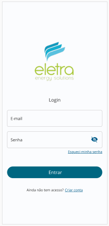

2. O usuário deverá preencher os dados do formulário com as informações do cliente a ser cadastrado.

3. O usuário deverá clicar em `Cadastrar` 

## Primeiro acesso ao E2R Mobile

**Passos para realizar login**

1. Digitar no campo e-mail, um e-mail válido de um usuário já cadastrado;

 

 

2.	Digitar a senha correspondente ao e-mail cadastrado.	

3.	O usuário deverá clicar no botão `ENTRAR`	O sistema deverá validar o usuário e liberar o acesso ao sistema.

 

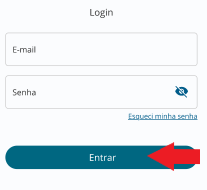 

## Recuperar senha de acesso do E2R Mobile

**Passos para recuperar senha**

1. O usuário deverá clicar no link `Esquecei minha senha` na interface de autenticação;

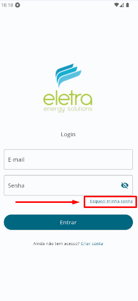 

 

2. O aplicativo irá direcionar o usuário para o formulário de redefinição de senha

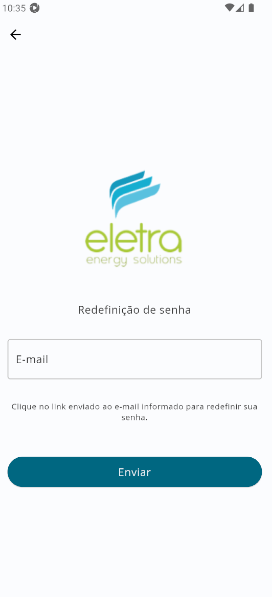 

 

3. O usuário deve informar no campo `E-mail` o endereço de e-mail cadastrado do usuário ao qual deseja recuperar a senha;

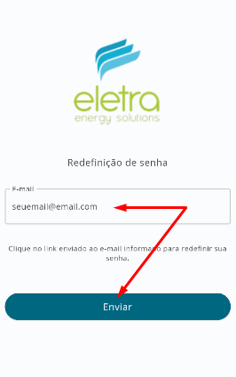 

 

4. E em seguida clicar no botão `Enviar` do formulário de Redefinição de Senha;
   
5. O usuário deverá verificar a caixa de entrada do email informado e localizar a mensagem recebida com sua nova senha de acesso.

`*` É importante realizar a alteração da senha após o término desse procedimento de redefinição de senha.

## Sair do E2R Mobile

**Passos para ralizar logout do aplicativo E2R Mobile**

1. O usuário deverá clicar na opção `Perfil` da barra de opções do aplicativo;
   

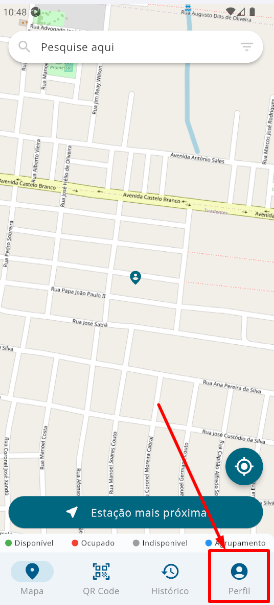 

 

2. O usuário deverá clicar na Opção `Sair`.
   

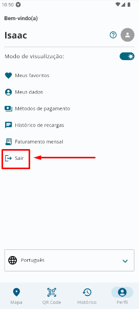 

 

3. O usuário deverá confirmar que deseja sair clicando na Opção `Confirmar`.

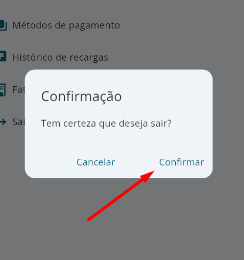 

 

## Abrir aglomerados de estações de recarga no mapa

**Passos para apliar os aglomerações de recargas do aplicativo E2R Mobile**

1. O usuário deverá observa os pontos de aglomeração indicados no mapa por icones em forma de balões com numeros inteiros em seu interior;
   

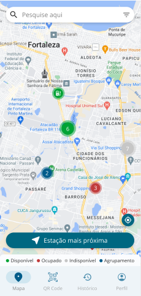 

 

2. O usuário deverá realizar o zoom na tela do dispositivo no aglomerado escolhido;
   

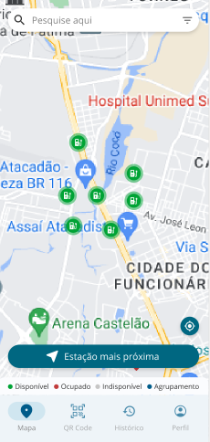 

 

## Abrir uma estações de recarga no mapa

**Passos para abrir uma estação de recargas do aplicativo E2R Mobile**

1. O usuário deverá clicar em uma estação de recarga listada no mapa, e o aplicativo irá abrir um modal com informações iniciais sobre a estação;
   

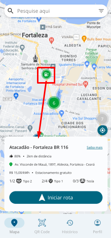 

 

## Abrir detalhes de uma estações de recarga no mapa

**Passos para abrir uma estação de recargas do aplicativo E2R Mobile**

1. O usuário deverá clicar em uma estação de recarga listada no mapa, e o aplicativo irá abrir um modal com informações iniciais sobre a estação;
   

 

 

2. O usuário deverá clicar no link `Saiba mais`que é apresentado logo após o nome do posto de recarga;
   

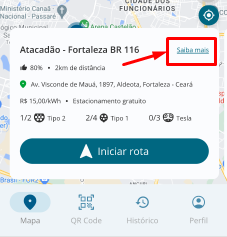 

 

3. O usuário terá acesso a página com mais detalhes da estação de recarga.

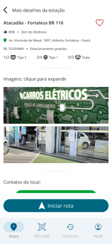 

 

