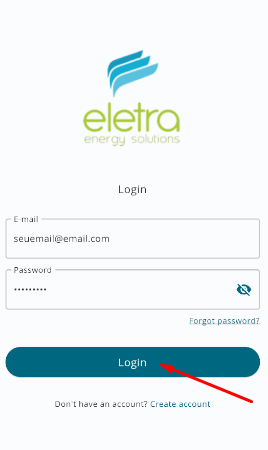

# Manual de Usabilidade

## Introdução

O objetivo deste documento é apresentar ao usuário como utilizar e navegar dentro do sistema Eletra Energy Solutions E2R Mobile.

# Requisitos do sistema 
 
Esse tópico visa apresentar os requisitos minimos para instalação do aplicativo Eletra Energy Solutions E2R.

## Sistemas suportados

Dispositivos dotados com os sistemas: 

- **Android:** Versão 7 (ou superior)
- **iOS:** Versão 11 (ou superior)

## Requisitos mínimos do dispositivo

Dispositivos móveis dotados com no mínimo:

- **CPU:** Processador (CPU) 1,7GHz (ou superior)
- **Memória:** 2 BG de RAM (ou superior)
- **Placa de Vídeo (GPU):** 700 MHz (ou superior)
- **Armazenamento disponível:** mínimo de 500 MB

# Navegação no aplicativo E2R Mobile

## Criação de conta de acesso ao E2R Mobile

**Passos para realizar o cadastro de usuário**

1. O usuário deverá clicar em `Criar Conta`
   

2. O usuário deverá preencher os dados do formulário com as informações do cliente a ser cadastrado.

3. O usuário deverá clicar em `Cadastrar` 

## Primeiro Acesso ao E2R Mobile

**Passos para realizar login**

1. Digitar no campo e-mail, um e-mail válido de um usuário já cadastrado;

  
 

2.	Digitar a senha correspondente ao e-mail cadastrado.	

3.	O usuário deverá clicar no botão `ENTRAR`	O sistema deverá validar o usuário e liberar o acesso ao sistema.

  
 

